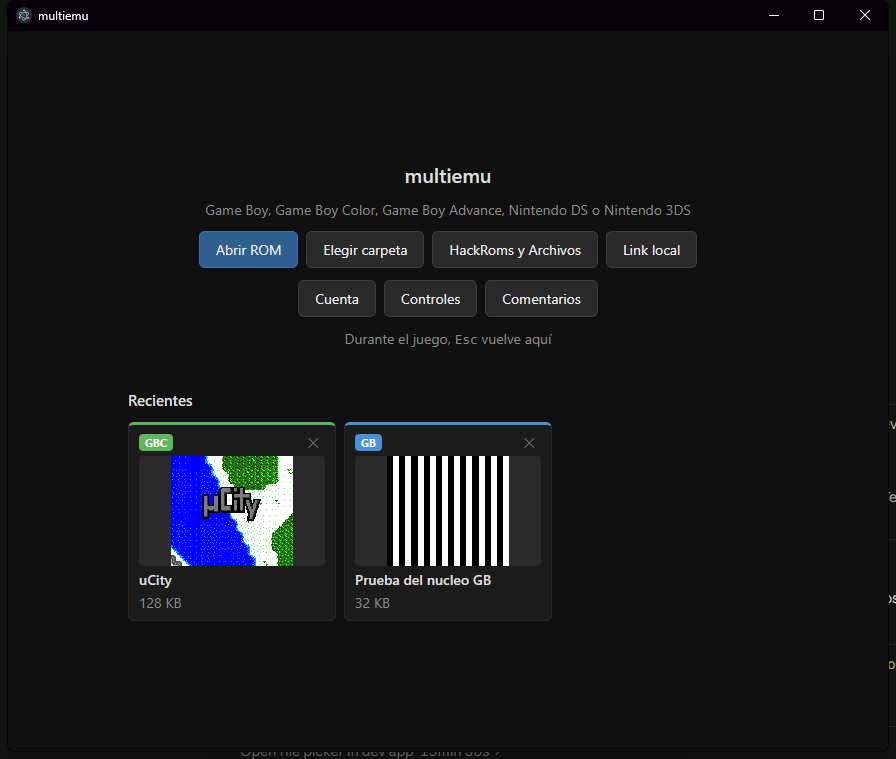
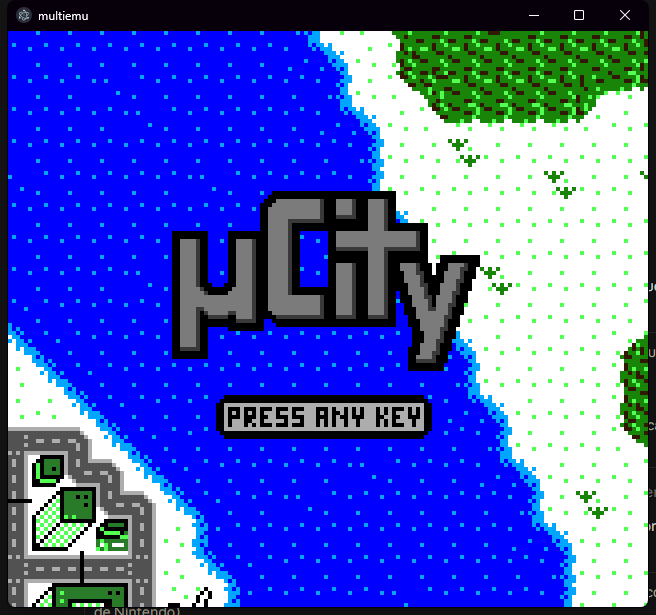
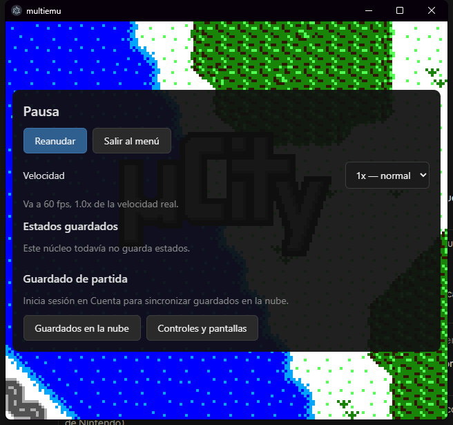

# multiemu for Windows

**English** · [Español](README.es.md)

[](LICENSE)
[](https://github.com/SKYACDX/multiemu_exe/actions/workflows/build-windows.yml)

A free, open-source multi-system emulator for Windows — Game Boy, Game Boy
Color, Game Boy Advance, Nintendo DS and Nintendo 3DS in one app — and the
desktop sibling of the [multiemu Android app](https://github.com/SKYACDX/multiemu).



## Download

- **Installer:** [emulatornds.online/app](https://www.emulatornds.online/app)
- **GitHub Releases:** [SKYACDX/multiemu_exe/releases](https://github.com/SKYACDX/multiemu_exe/releases)

Every installer is built by the [`build-windows`](.github/workflows/build-windows.yml)
workflow from a tagged commit of this repository — never on someone's PC —
so what you download is exactly what this source compiles to. The installer
is not code-signed yet, so Windows SmartScreen may warn on first run.

**No games are included.** multiemu is only the emulator: use your own
legally obtained game dumps. 3DS games must be decrypted dumps.

## Supported systems

| System | Emulation core |
|---|---|
| Game Boy / Game Boy Color | multiemu's own core (shared with the Android app) |
| Game Boy Advance | [mGBA](https://github.com/mgba-emu/mgba) |
| Nintendo DS | [melonDS](https://github.com/melonDS-emu/melonDS) |
| Nintendo 3DS | [Azahar](https://github.com/azahar-emu/azahar) (Citra's successor) |

## What sets it apart

- **Cloud saves shared with Android.** Sign in with a free RomHack Hub
  account and your in-game saves sync between your PC and your phone.
- **3DS local wireless over the internet, PC ↔ Android.** Join one of ten
  rooms from the pause menu and the game sees everyone in the room as if
  they were next to you — trades and battles between a PC and a phone.
- **Two players on one PC.** Game Boy and GBA link cable and DS local
  wireless, with Tab switching who you control.
- **Reproducible builds.** The released installer comes from CI, built from
  this public source with pinned core versions and the patches in
  [`patches/`](patches/).
- Save states (GBA, DS, 3DS), remappable keyboard and gamepad controls,
  speed control, and the game's own icon and title in Recents.

| In game (µCity, a free homebrew) | Pause menu |
|---|---|
|  |  |

The game in these screenshots is [µCity](https://github.com/AntonioND/ucity)
by Antonio Niño Díaz (GPL-3.0-or-later; graphics CC BY-SA 4.0). The striped
one is the test ROM of multiemu's own Game Boy core.

## Building from source

Requirements: Node 22+, Visual Studio 2022 with the C++ workload and its
CMake component (`cmake` on the `PATH`).

```
git clone --recurse-submodules https://github.com/SKYACDX/multiemu_exe.git
cd multiemu_exe
npm install
npm run vendor:mgba     # fetch each core at its pinned tag (third_party/ is not versioned)
npm run vendor:melonds  # ...and apply its patches
npm run vendor:azahar
npm run build:mgba      # once each; these take a while (Azahar ~40 min)
npm run build:melonds
npm run build:slirp
npm run build:azahar
npm start               # build the addons and open the app
npm test                # smoke test of the native bridges
```

The developer notes — Windows build details, the patches, the 3DS room
server, cloud-save contracts and how releases are published — are in the
[Spanish README](README.es.md).

## Credits

multiemu stands on the work of [melonDS](https://github.com/melonDS-emu/melonDS),
[mGBA](https://github.com/mgba-emu/mgba), [Azahar](https://github.com/azahar-emu/azahar),
[libslirp](https://gitlab.freedesktop.org/slirp/libslirp) and
[Electron](https://github.com/electron/electron). Each keeps its own
license; see [THIRD_PARTY_NOTICES.md](THIRD_PARTY_NOTICES.md).

## Reporting problems

Open an [issue](https://github.com/SKYACDX/multiemu_exe/issues/new/choose)
with the bug or feature template, or use **Comentarios** inside the app.
Please don't attach or link game ROMs. See [CONTRIBUTING.md](CONTRIBUTING.md)
to send changes.

## License

multiemu is free software under the [GNU GPL v3 or later](LICENSE).
